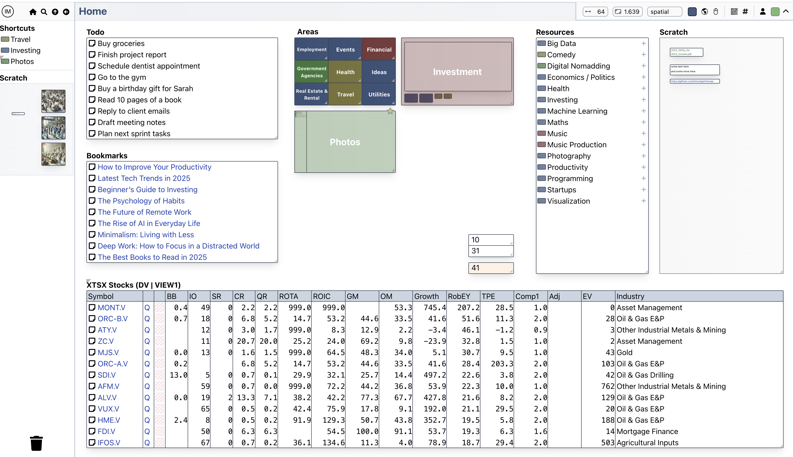

# Infumap

The traditional computer desktop is very transient — launch an app, open a file manager, do some work, then close everything. There is no lasting visual structure. What if your desktop was more like a giant workspace that persists over time? And what if your desktop provided a collection of flexible building blocks that were powerful enough to facilitate many of the tasks you would traditionally need dedicated applications for?

I have wondered this for as long as I can remember, and finally built Infumap as a way of exploring the idea. It's still pretty rough around the edges, but it's clear that the concept works - Infumap has become the platform I run my life off of and I wouldn't have it any other way.

The high level concept is not novel, for example [Muse](https://museapp.com/) and [Kosmik](https://www.kosmik.app/) are two relatively recent projects with similar goals. Infumap is quite different though and feels different to use - more closely aligns with my own preferences and requirements. It is also open source - something I think is table stakes for the system I'm trusting to store all of my personal information.

<kbd>
  
</kbd>

## Development Status

My goals in developing Infumap, in order, are:

1. Make something I want to use.
2. Explore new ideas that I think are valuable.
3. Hopefully end up with something that other people want to use as well.

The first two goals mean that I've often been more inclined to add features than completely polish existing ones. As a result, there are many things that are currently a bit broken or not completely implemented. But nothing you can't work around. Also, I haven't cut corners in places where corners cannot be cut (in particular security) - the current implementation is more than just a demo.

Going forward, I will continue to add features and polish existing ones as this aligns with my own needs. If I start to see other people finding value here (the simplest way you can demonstrate your interest is give the project a github star!), I'll be motivated to give the project a lot more time and prioritize more general purpose goals in addition to my own.


## Running

For detailed information on deploying Infumap, refer to the [docs](/docs). Currently you need to build Infumap from source. Having done this, everything is provided in a self contained executable. To start Infumap, simple run it from the command line:

```
./infumap web
```

Then point your web browser at `http://localhost:8000`.

Default configuration and data directories will be created automatically.

You can use Infumap locally, or install it on a server on the internet in order to:
- Access your information from anywhere.
- Integrate with other services.
- Share content or reference content authored by others.

## MacOS Settings

Infumap is developed on an Apple Mac, and as such probably works best on this platform (hasn't been tested on others). However,
there are some settings which you should tweak for optimal experience:

In System Preferences / Trackpad:

- Turn off "Smart zoom". If enabled, the system needs to wait to know if a two finger tap was a double tap. Since navigation in Infumap makes frequent use of right clicking (two finger tapping), your experience will be more fluid with this disabled.
- Consider turning off "Swipe between pages".
